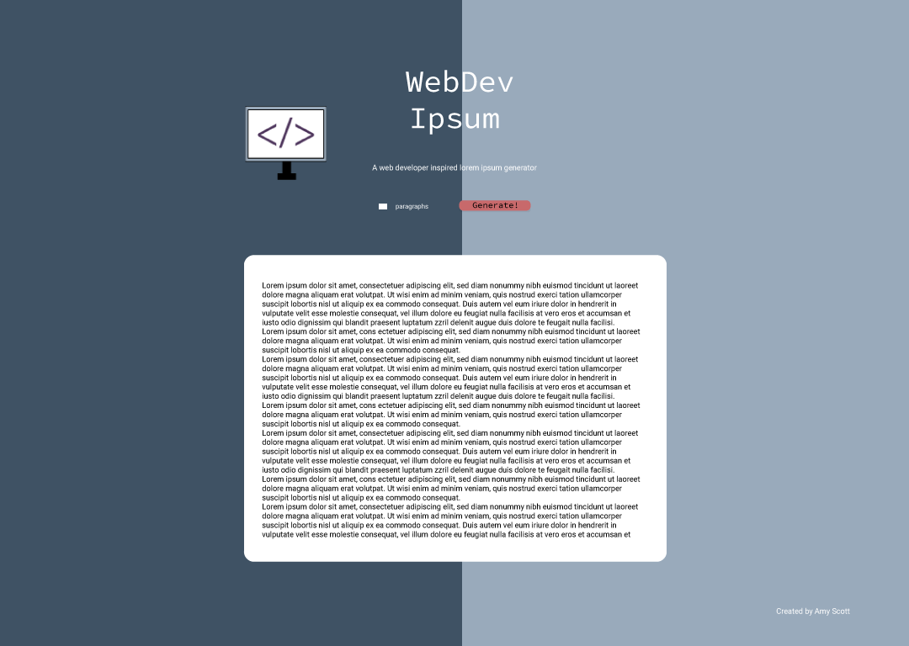

# Web Dev Lorem Ipsum
> A lorem ipsum for web developers! 

## Table of contents
* [General info](#general-info)
* [Screenshot](#screenshot)
* [Prototype - Adobe XD](#prototype)
* [Technologies](#technologies)
* [Features](#features)
* [Status](#status)
* [Inspiration](#inspiration)
* [Contact](#contact)

## General info
There are a lot of really awesome lorem generators out there (mmm bacon) but I wanted to make one just for us web developers. Includes some of our favorite terms like class, id, href, and more!

## Screenshot

## Prototype

<a href="https://xd.adobe.com/view/906f8198-46af-4b4c-ba84-2f60ac39eeb6-c53c/" target="_blank">Adobe XD Prototype</a>

## Technologies
* HTML
* CSS(Tailwind CSS)
* JavaScript

## Code Examples
None yet!

## Features

* Generate paragraphs of web dev lorem ipsum
* Lots of web dev terms from many languages and frameworks (HTML, CSS, JS, pHp, Bootstrap, etc)
* I may even throw in hexidecimal codes for fun! :)

To-do list:
* Prototyping
* Development
* User testing

## Status
Project is: 
In Progress

## Inspiration
Inspried by <a href="https://baconipsum.com/">Bacon Ipsum</a> and <a href="http://www.catipsum.com/">Cat Ipsum<a/>

## Contact
Created by Amy Scott (amyscotteng@gmail.com)
